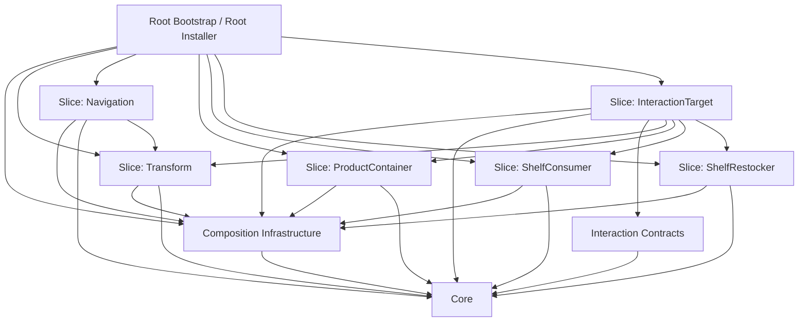

# Game.World Architecture Spec

## Status

Accepted target architecture for the current `Game.World` package shape.

This document describes the maintained architecture after the v3-to-v4 ownership migration. It does not introduce code by itself.

## Context

`Game.World` is a Unity gameplay module.

The current v3 baseline is already in place:

- composition uses `ICompositionModule`;
- `FeatureModule<TPart, TFeature>` is the reusable module base;
- `EntityCompositionContext` is the composition-time context;
- `SceneCompositionBootstrap` starts composition on scene init;
- composition is the outer orchestration layer;
- interactions are composed capabilities, not a second assembly pipeline;
- legacy `Step + Factory` and the shim layer are already removed;
- the codebase already prefers a vertical-by-capability physical layout.

That baseline is good, but it still leaves one architectural problem unresolved: slices are mostly folders, while the design is still mentally centered around shared horizontal hubs such as `Features`, `Parts`, and `Installers`.

This spec defines the next target: real slice-oriented components with explicit package boundaries and dependency rules.

Two accepted project constraints stay outside this architectural spec:

- the external `NuGetForUnity.dll` build blocker;
- the accepted `restock` validation gap until the interaction migration work is completed.

Neither of them is an architecture problem and neither changes the target described here.

`Game.World.Debugging` is also outside the runtime ownership model described below. It is a support package for manual test harnesses, not part of the runtime package architecture.

## Problems

- Physical vertical folders exist, but logical ownership is still too horizontal.
- Shared role buckets such as `Features`, `Parts`, and `Installers` still read like architecture centers instead of implementation roles.
- A developer can still place a type by role name instead of by slice ownership.
- Package boundaries are not sharp enough to support future namespace cleanup or `asmdef` extraction.
- Cross-slice dependencies exist, but the allowed targets are not explicit enough to review mechanically.
- The ownership split between shared infrastructure, slice-local code, scene authoring, runtime contracts, and composition orchestration is not strict enough.
- The interaction layer is no longer a second pipeline, but the boundary between shared interaction contracts and concrete target-side behavior still needs to be spelled out precisely.

## Goals

- Make the target package/component architecture explicit.
- Treat each gameplay capability as a real slice-oriented component, not just a vertical folder.
- Keep shared infrastructure minimal and stable.
- Define clear ownership for `Core`, composition infrastructure, interaction contracts, authoring parts, runtime features, and bootstrap/installers.
- Define allowed dependency directions and forbidden directions.
- Keep composition as the single outer orchestration layer.
- Keep interactions as composed capabilities inside the same world model.
- Make it obvious where a new class should live and what it may depend on.
- Guide future refactors without reopening the same naming and boundary decisions.

## Non-goals

- Redesign gameplay behavior.
- Introduce a second composition pipeline for interactions.
- Introduce a service locator pattern.
- Introduce a generic mega-framework.
- Redesign persistence semantics.
- Solve external repository build issues such as `NuGetForUnity.dll`.
- Reframe the accepted `restock` validation gap as an architectural issue.

## Architectural decisions

### 1. Capability slice is the primary component boundary

The primary ownership boundary in `Game.World` is a gameplay capability slice such as:

- `Transform`
- `Navigation`
- `ProductContainer`
- `ShelfConsumer`
- `ShelfRestocker`
- `InteractionTarget`

`Feature`, `Part`, `Module`, and `Installer` are roles inside a slice. They are not peer architecture packages.

The target is not "more vertical folders". The target is one component per capability, with clear ownership and explicit dependency direction.

### 2. Only three shared packages stay shared

The shared architecture of `Game.World` is intentionally small:

- `Core`
- `Composition`
- `Interactions`

Everything else belongs to an owning slice.

A type may be promoted into a shared package only when both conditions are true:

- it is referenced by more than one slice or by root composition infrastructure and at least one slice;
- it contains no slice-specific behavior, vocabulary, or serialized scene data.

If either condition is false, the type stays in its owning slice.

### 3. Composition remains the only orchestration layer

Composition is still responsible for:

- creating `EntityCompositionContext`;
- ordering modules;
- finding authoring parts;
- creating runtime features;
- binding parts to features;
- completing `EntityRoot` composition;
- persisting state after composition.

Interactions do not get their own assembly pipeline, bootstrap path, or composition lifecycle. They remain runtime capabilities assembled by the same composition flow.

### 4. `Part` is intentionally a scene-side adapter

The chosen direction is:

`Part` is a scene-side adapter and may implement runtime-facing contracts when that contract is inherently authoring-local.

This is intentional and should stay that way.

Rationale:

- Unity scene authoring is part of the gameplay model, not an external concern.
- `FeatureModule<TPart, TFeature>` already treats `Part` as the bridge between authoring and runtime.
- resolver parts are naturally authoring-local and do not benefit from an extra adapter layer;
- keeping the bridge local avoids duplicating scene data, adapter objects, and registration code.

Rules that follow from this decision:

- `Part` owns serialized scene configuration;
- `Part` may bind Unity-side behavior to a runtime feature;
- `Part` may implement a shared runtime-facing contract if the contract is scene-local, lightweight, and authoring-owned;
- `Part` may contain authoring-local interaction resolution logic;
- `Part` must not own long-lived gameplay state that belongs in a runtime feature or slice state object;
- runtime features never depend back on parts.

### 5. Runtime features are slice-owned runtime API

A runtime feature is the slice-owned gameplay capability exposed to the rest of the world.

A slice exposes:

- a public runtime interface;
- a runtime implementation;
- slice state when the capability persists or derives runtime state;
- slice-local helpers that remain private to the slice.

The runtime feature is not composition infrastructure and is not scene authoring.

### 6. Interaction contracts are shared, concrete interactions are slice-owned

`Interactions` owns the shared contracts needed across slices, including:

- executable interaction contract;
- resolver contract;
- the minimal target-facing runtime contract that resolvers need.

The `InteractionTarget` slice owns the concrete target capability implementation and authoring.

`Interactions` also owns `InteractionResolverPart` as the shared ordered authoring base for resolver components.

Concrete resolver parts and concrete interaction types belong to the slice that owns the behavior. For the current model, target-specific resolver parts and shelf interaction implementations live in `InteractionTarget`, not in the shared `Interactions` package.

### 7. Bootstrap is shared, module installers are slice-local

There is one shared composition bootstrap path for the world:

- `EntityCompositionInstaller`
- `SceneCompositionBootstrap`
- `EntityComposer`

Each capability slice owns its own module installer that registers only that slice and any slice-local support objects.

The root bootstrap is shared infrastructure.

Slice installers are part of the slice.

### 8. Cross-slice access goes through public runtime contracts only

When one slice depends on another slice, it should depend on the other slice's public runtime contract, not on:

- the other slice's part;
- the other slice's module;
- the other slice's installer;
- the other slice's concrete state implementation unless that state type is explicitly part of the public contract.

This keeps slices composable without turning the codebase into a shared horizontal pool again.

## Target package structure

In this spec, "package" means a stable ownership and dependency boundary.

During the transition it is represented by folder placement and namespace ownership. Future `asmdef` extraction must follow the same boundaries rather than redefine them.

The current physical root `Modules/<Slice>` may remain during transition. The important rule is that each child slice is a component boundary, not that `Modules` becomes a new horizontal hub.

Target structure:

```text
Game/World/
  Core/
  Composition/
  Interactions/
  Debugging/
  Modules/
    Transform/
    Navigation/
    ProductContainer/
    ShelfConsumer/
    ShelfRestocker/
    InteractionTarget/
```

Target package responsibilities:

### Ownership categories

The architecture distinguishes five categories and keeps them separate:

- shared infrastructure
  - `Core`, `Composition`, `Interactions`
- slice-local runtime contracts
  - public slice interfaces such as `INavigationFeature`
- slice-local runtime implementation
  - concrete features, state, and slice-only helpers
- scene authoring
  - `Part` classes and resolver-part classes
- composition orchestration
  - `EntityComposer`, `SceneCompositionBootstrap`, root composition installer, and slice `*Module` plus `*ModuleInstaller`

The same class must not try to play more than one of these ownership roles, except for the intentional `Part` decision above: a scene-side `Part` may implement an authoring-local runtime-facing contract.

A shared package may own a minimal authoring base only when that base is cross-slice infrastructure and contains no slice-specific behavior. In the current target, `FeaturePart<TFeature>` and `InteractionResolverPart` are the intended exceptions.

### `Core`

Owns the stable world-level primitives that are not specific to any capability slice:

- `EntityRoot`
- entity identity
- base runtime feature abstraction
- base entity state abstraction
- state store abstraction and basic implementation

`Core` is the innermost package.

`Core` does not own capability-specific runtime interfaces, authoring parts, modules, installers, or concrete interactions.

### `Composition`

Owns the generic composition infrastructure:

- `ICompositionModule`
- `FeatureModule<TPart, TFeature>`
- `EntityCompositionContext`
- `EntityComposer`
- `SceneCompositionBootstrap`
- root composition installer
- shared composition-side part abstractions such as `IFeaturePart<TFeature>` and `FeaturePart<TFeature>`

`Composition` is generic infrastructure. It must not know concrete slices.

`Composition` owns orchestration, not gameplay rules.

### `Interactions`

Owns only the contracts that truly span slices:

- `IEntityInteraction`
- `IInteractionResolver`
- the shared interaction-target runtime contract used by resolvers
- `InteractionResolverPart`

`Interactions` is a shared contract package, not a home for concrete gameplay interactions.

`Interactions` does not own shelf-specific interactions, target-specific resolver components, or the concrete interaction-target feature.

### `Debugging`

`Debugging` is a support package outside the runtime ownership model.

It owns scene-side manual test harnesses such as click-to-move or interaction testers.

`Debugging` may depend on public runtime contracts and scene-facing test hooks as needed to exercise the runtime model, but it is not a gameplay owner package.

`Debugging` must not become:

- a shared gameplay hub;
- a fallback package for unresolved ownership;
- a place for permanent gameplay logic.

### Capability slice package

Each capability slice owns its full implementation surface:

- public runtime feature interface
- runtime feature implementation
- slice state
- scene authoring parts
- composition module
- slice module installer
- slice-local helpers
- concrete interactions and concrete resolver parts owned by that slice

Example ownership:

- `Navigation` owns `INavigationFeature`, `NavigationFeature`, `NavigationState`, `NavigationPart`, `NavigationModule`, `NavigationModuleInstaller`
- `ProductContainer` owns `IProductContainerFeature`, `ProductContainerFeature`, `ProductContainerState`, `ProductContainerPart`, `ProductContainerModule`, `ProductContainerModuleInstaller`
- `InteractionTarget` owns `InteractionTargetPart`, `InteractionTargetFeature`, `InteractionTargetModule`, `InteractionTargetModuleInstaller`, and target-specific resolver parts and interactions

Target naming is slice-first, not hub-first. A type should read like "owned by Navigation" or "owned by Composition", not like "belongs to the global Features or Parts bucket".

A file move into `Modules/<Slice>` without matching ownership and dependency cleanup does not satisfy this spec.

## Mermaid package/component diagram



The diagram covers the runtime ownership model only. `Debugging` is intentionally omitted because it is a support package outside that model.

Arrows mean allowed package-level dependency direction in the current target shape. Cross-slice arrows mean dependency on public runtime contracts only, never on another slice's authoring or bootstrap internals.

## Dependency rules

### Allowed directions

- `Core` has no dependency on other `Game.World` packages.
- `Composition` may depend on `Core`.
- `Interactions` may depend on `Core`.
- `Debugging` may depend on `Core`, `Composition`, `Interactions`, and public runtime contracts or scene-facing test hooks from slices as needed for manual test harnesses.
- A capability slice may depend on:
  - `Core`
  - `Composition`
  - `Interactions`
  - another capability slice's public runtime contract, but only when that dependency is required by domain behavior and is consistent with the package diagram
- Root bootstrap may depend on `Composition` and slice installers.

### Forbidden directions

- `Core` must not depend on `Composition`, `Interactions`, or any capability slice.
- `Composition` must not depend on concrete capability slices.
- `Interactions` must not depend on concrete capability slices or on `Composition`.
- Runtime packages and capability slices must not depend on `Debugging`.
- `Debugging` must not own gameplay logic or become a shared gameplay hub.
- A capability slice must not depend on another slice's:
  - `Part`
  - `Module`
  - `ModuleInstaller`
  - concrete runtime implementation unless that implementation is intentionally published as part of the slice API
- Runtime feature and runtime state classes must not depend on:
  - `EntityCompositionContext`
  - `EntityComposer`
  - `SceneCompositionBootstrap`
  - DI installers
  - scene authoring parts
- Only composition infrastructure and slice `*Module` classes may read `EntityCompositionContext`.
- A slice installer must not contain gameplay logic or compose sibling slices directly.
- `EntityCompositionContext` must not become a general runtime service locator used after composition.
- New permanent shared hubs such as `Game.World.Features`, `Game.World.Parts`, or `Game.World.Installers` must not be reintroduced as architecture centers.

### Review checks

A reviewer should be able to verify the architecture with these yes/no checks:

- Can every runtime `Game.World` type be assigned to exactly one owner package: `Core`, `Composition`, `Interactions`, or one concrete slice?
- Is `Game.World.Debugging` treated as a support package rather than as part of the runtime ownership model?
- Does every capability-specific type live in its owning slice rather than in a role bucket?
- Does each moved type declare a namespace that matches its owner package rather than a horizontal role bucket?
- Do shared packages avoid concrete slice names and slice-specific gameplay behavior?
- Do cross-slice references target only public runtime contracts or shared interaction contracts?
- Do cross-slice references stay within the dependency edges shown in the package diagram unless the spec is explicitly updated first?
- Do runtime feature and state classes avoid composition types, installers, and scene parts?
- Do only `*Module` classes in slices read `EntityCompositionContext`?
- Does each slice installer register only its own slice?

## Slice template

Expected contents of one capability slice, using `Navigation` as the example:

```text
Modules/
  Navigation/
    INavigationFeature.cs
    NavigationFeature.cs
    NavigationState.cs
    NavigationPart.cs
    NavigationModule.cs
    NavigationModuleInstaller.cs
    NavMeshAgentExtensions.cs
```

Role of each file:

- `INavigationFeature`
  - the public runtime contract other slices may depend on
- `NavigationFeature`
  - the runtime implementation owned by the slice
- `NavigationState`
  - the slice-specific persisted or runtime state object
- `NavigationPart`
  - the scene-side authoring adapter with serialized data and Unity bindings
- `NavigationModule`
  - the composition entry point for the slice
- `NavigationModuleInstaller`
  - the slice-local DI registration for the module and slice-local support types

Placement rules:

- a new public runtime contract for `Navigation` goes into the `Navigation` slice;
- a new concrete runtime implementation or state type for `Navigation` goes into the `Navigation` slice;
- a new `MonoBehaviour` used for scene authoring or binding in `Navigation` goes into the `Navigation` slice and uses the `Part` suffix;
- a new type that reads `EntityCompositionContext` goes into the `Navigation` slice and uses the `Module` suffix;
- a new DI registration type for `Navigation` goes into the `Navigation` slice and uses the `ModuleInstaller` suffix;
- a helper referenced only by `Navigation` stays in the `Navigation` slice;
- a concrete interaction or concrete resolver owned by `Navigation` stays in the `Navigation` slice;
- a type is promoted out of `Navigation` only when it satisfies the shared-package rule defined above.

Forbidden placements:

- `NavigationPart` must not be moved to a shared `Parts` package;
- `NavigationFeature` must not be moved to a shared `Features` package;
- `NavigationModuleInstaller` must not be moved to a shared `Installers` package;
- sibling slices must not reference `NavigationPart` or `NavigationModule` directly.

## Migration implications

This spec starts from the current v3 state rather than from the removed legacy pipeline.

Implications for future refactors:

- keep `Core`, `Composition`, and `Interactions` as the only shared architecture packages;
- treat each capability under `Modules/<Slice>` as a real component boundary;
- move remaining horizontal namespace ownership toward slice ownership;
- keep `FeatureModule<TPart, TFeature>` as shared composition infrastructure rather than cloning composition base logic into slices;
- keep `Part` as the scene-side adapter model rather than introducing a second authoring-to-runtime bridge layer;
- move only truly shared interaction contracts into `Interactions`;
- keep concrete interactions and concrete resolver parts in owning slices;
- do not reintroduce `Step + Factory`;
- do not reintroduce a shim layer as a permanent architectural device;
- do not judge the architecture by folder names alone; judge it by ownership and dependency direction;
- do not count a refactor as complete when files moved but ownership stayed horizontal.

One concrete consequence of this spec is that future cleanup should converge on slice-first package ownership even if the temporary physical root remains `Modules/`.

Another concrete consequence is that any shared interaction-target contract needed by resolvers should belong to `Interactions`, while the concrete `InteractionTarget` capability remains a normal slice that implements that contract.

## Acceptance criteria

- The target architecture can be explained in terms of `Core`, `Composition`, `Interactions`, and capability slices.
- Every non-shared gameplay type has one obvious owning slice.
- `Features`, `Parts`, and `Installers` are treated as slice-local roles, not as global architecture packages.
- `Composition` remains generic shared orchestration and does not depend on concrete slices.
- Interactions remain part of the same composition model and do not introduce a second pipeline.
- `Part` is explicitly treated as a scene-side adapter and may implement authoring-local runtime-facing contracts without introducing a second adapter layer.
- Cross-slice dependencies are limited to public runtime contracts and shared interaction contracts.
- `Debugging` is treated as a support package outside the runtime ownership model, and runtime packages do not depend on it.
- A reviewer can verify package ownership and forbidden dependency directions by inspecting declared namespaces, file placement, and direct type references.
- A developer adding a new capability can use the slice template and dependency rules without reopening naming or boundary decisions.
